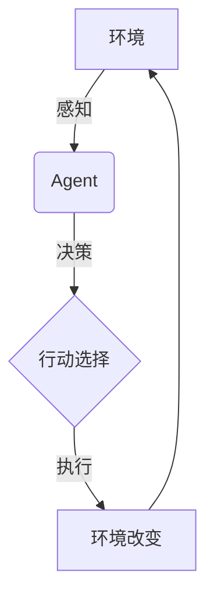
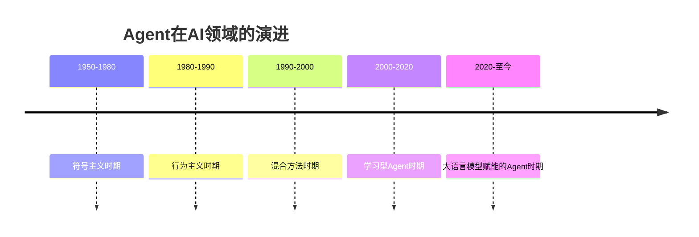

# 1: Agent的基础概念与发展历程

1.1 什么是Agent?

首先，我们需要回答一个基本问题：什么是Agent？

Agent，中文常译为"智能体"或"代理"，是人工智能领域中一个核心概念。简单来说，Agent是一个能够感知环境、做出决策并采取行动的实体。它就像是我们在数字世界中的"化身"，能够代表我们执行各种任务。

让我们用一个生动的比喻来理解Agent：想象你有一个非常聪明的机器人助手，它能看懂你的指令，理解周围的环境，并且能够独立完成你交给它的任务。这个机器人助手就是一个典型的Agent。

Agent的定义可以用以下公式表示：

```
Agent = Perception + Decision Making + Action
```

这个公式虽然简单，但它概括了Agent的三个核心功能：感知、决策和行动。

为了更直观地理解Agent的工作流程，我们可以用下面的流程图来表示：



在这个循环中，Agent不断地感知环境、做出决策、采取行动，然后观察环境的变化，再次做出决策。这个过程是持续的，使得Agent能够在复杂多变的环境中完成任务。

1.2 Agent的哲学起源

Agent的概念并非凭空而来，它有着深厚的哲学根源。早在古希腊时期，哲学家亚里士多德就探讨过"行为主体"的概念。他认为，一个真正的行为主体应该具有自主性，能够根据自己的意愿做出选择。

18世纪的法国哲学家丹尼斯·狄德罗曾说过一句有趣的话：

"如果他们发现一只鹦鹉可以回答一切问题，我会毫不犹豫地称它为智能生物。"

这句话虽然是在讨论智能，但它实际上触及了Agent的核心特征：能够理解和回应外界的刺激。在AI领域，我们可以将这个概念延伸为：如果一个AI系统能够理解并恰当地回应各种输入，那么它就可以被视为一个Agent。

1.3 Agent在AI领域的演进

Agent概念在AI领域的发展经历了几个重要阶段：

1. 符号主义时期（20世纪50-80年代）：这个时期的Agent主要基于符号逻辑和规则推理。例如，1971年的STRIPS（STanford Research Institute Problem Solver）就是一个典型的规划Agent。
2. 行为主义时期（20世纪80-90年代）：这个时期强调Agent与环境的直接交互，不再过分依赖内部表示。Rodney Brooks的"subsumption architecture"是这个时期的代表作。
3. 混合方法时期（20世纪90年代至今）：结合了符号主义和行为主义的优点，如BDI（Belief-Desire-Intention）架构。
4. 学习型Agent时期（21世纪初至今）：随着机器学习特别是深度学习的发展，能够从经验中学习的Agent成为主流。
5. 大语言模型赋能的Agent时期（近年来）：随着GPT等大语言模型的出现，Agent的能力得到了显著提升，特别是在自然语言理解和生成方面。

我们可以用下面的时间线来直观地展示这个演进过程：



1.4 Agent的关键特性

一个成熟的Agent通常具有以下关键特性：

1. 自主性（Autonomy）：Agent能够在没有直接人类干预的情况下独立运作。
2. 反应性（Reactivity）：Agent能够感知环境并及时做出响应。
3. 主动性（Pro-activeness）：Agent不仅能被动响应，还能主动采取行动以达成目标。
4. 社交能力（Social ability）：Agent能与其他Agent或人类进行交互和协作。

这些特性可以用下面的代码来形象地表示：

```python
class Agent:
    def __init__(self):
        self.autonomy = True
        self.reactivity = True
        self.pro_activeness = True
        self.social_ability = True

    def perceive(self, environment):
        # 感知环境
        pass

    def decide(self):
        # 做出决策
        pass

    def act(self):
        # 执行行动
        pass

    def communicate(self, other_agent):
        # 与其他Agent交互
        pass

```

这个简单的Python类展示了一个Agent的基本结构和功能。当然，实际的Agent实现要复杂得多，但这个例子帮助我们理解Agent的核心概念。

总结一下，Agent是AI领域一个重要的研究方向，它代表了一种能够自主感知、决策和行动的智能实体。从哲学概念到AI实现，Agent的发展体现了人类对智能本质的不断探索。在接下来的章节中，我们将深入探讨Agent的各个组成部分，以及它们如何协同工作来完成复杂的任务。

现在，让我们进入下一章，探讨Agent的核心组成部分！