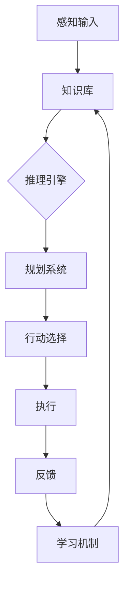
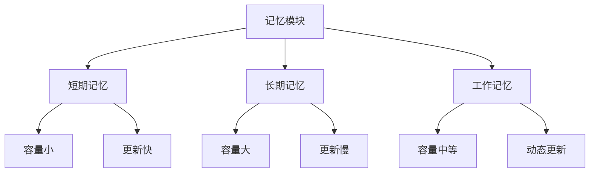

# 2: Agent的核心组成部分

在上一章中，我们了解了Agent的基本概念和发展历程。现在，让我们深入探讨Agent的内部结构，看看它是如何工作的。就像人类有眼睛、大脑和手脚，Agent也有类似的组成部分，让它能够感知、思考和行动。

2.1 感知模块：Agent的"眼睛"

感知模块是Agent与外界环境交互的第一道关口，就像是Agent的"眼睛"和"耳朵"。它负责收集环境中的信息，并将这些信息转换为Agent内部可以理解和处理的格式。

在传统的AI系统中，感知模块可能只能处理特定类型的输入，比如文本或图像。但随着技术的发展，现代Agent的感知能力变得越来越强大和多样化。特别是在大语言模型（LLM）的加持下，Agent可以处理多模态的输入，包括但不限于：

1. 文本输入：这是最基本的输入形式，Agent可以理解和处理自然语言。
2. 视觉输入：通过计算机视觉技术，Agent可以"看到"并理解图像和视频。
3. 听觉输入：语音识别技术使Agent能够"听懂"人类的语音。
4. 其他感官输入：在某些特殊应用中，Agent甚至可以处理触觉、嗅觉等其他感官信息。

让我们用一个简单的代码示例来说明多模态感知模块的基本结构：

```python
class PerceptionModule:
    def __init__(self):
        self.text_processor = TextProcessor()
        self.image_processor = ImageProcessor()
        self.audio_processor = AudioProcessor()

    def perceive(self, input_data):
        if isinstance(input_data, str):
            return self.text_processor.process(input_data)
        elif isinstance(input_data, Image):
            return self.image_processor.process(input_data)
        elif isinstance(input_data, Audio):
            return self.audio_processor.process(input_data)
        else:
            raise ValueError("Unsupported input type")

```

这个简化的`PerceptionModule`类展示了如何处理不同类型的输入。在实际应用中，这个模块会更加复杂，可能涉及到深度学习模型的使用，如卷积神经网络(CNN)处理图像，循环神经网络(RNN)或Transformer处理序列数据等。

2.2 决策模块：Agent的"大脑"

决策模块是Agent的核心，就像是它的"大脑"。这个模块接收来自感知模块的信息，结合Agent的知识库和目标，做出相应的决策。在现代AI系统中，特别是基于大语言模型的Agent，决策模块通常包含以下几个关键部分：

1. 知识库：存储Agent的知识和经验。
2. 推理引擎：基于已知信息进行逻辑推理。
3. 规划系统：制定达成目标的计划。
4. 学习机制：从经验中学习，不断优化决策过程。

让我们用一个流程图来展示决策模块的工作流程：



在基于大语言模型的Agent中，决策模块的能力得到了显著提升。例如，GPT系列模型展现出了强大的few-shot学习能力，能够快速适应新任务。这使得Agent能够更灵活地处理各种复杂情况。

以下是一个简单的决策模块示例代码：

```python
class DecisionModule:
    def __init__(self, knowledge_base, goal):
        self.knowledge_base = knowledge_base
        self.goal = goal

    def make_decision(self, perception):
        # 结合感知信息和知识库进行推理
        context = self.knowledge_base.query(perception)

        # 使用大语言模型进行决策
        decision = self.llm.generate(context, self.goal)

        # 学习和更新知识库
        self.knowledge_base.update(perception, decision)

        return decision

```

这个简化的`DecisionModule`展示了决策过程的基本流程。在实际应用中，这个过程可能涉及到更复杂的算法，如强化学习、蒙特卡洛树搜索等。

2.3 执行模块：Agent的"手脚"

执行模块负责将决策模块的输出转化为具体的行动，就像Agent的"手脚"。这个模块的复杂程度取决于Agent需要执行的任务类型。例如：

1. 对于一个聊天机器人，执行模块可能只需要生成文本响应。
2. 对于一个游戏AI，执行模块需要控制游戏角色的移动和动作。
3. 对于一个机器人，执行模块需要控制机械臂或轮子等物理部件。

在基于大语言模型的Agent中，执行模块通常包括以下几个部分：

1. 文本生成：生成自然语言响应。
2. 工具使用：调用外部API或工具完成特定任务。
3. 行动执行：在虚拟或物理环境中执行具体动作。

以下是一个简单的执行模块示例代码：

```python
class ExecutionModule:
    def __init__(self):
        self.text_generator = TextGenerator()
        self.tool_user = ToolUser()
        self.action_executor = ActionExecutor()

    def execute(self, decision):
        if decision.type == "text":
            return self.text_generator.generate(decision.content)
        elif decision.type == "tool":
            return self.tool_user.use_tool(decision.tool, decision.params)
        elif decision.type == "action":
            return self.action_executor.execute(decision.action)
        else:
            raise ValueError("Unsupported decision type")

```

这个`ExecutionModule`展示了如何处理不同类型的决策输出。在实际应用中，每个子模块（如`TextGenerator`、`ToolUser`、`ActionExecutor`）都可能是复杂的系统。

2.4 记忆模块：Agent的"经验库"

记忆模块是Agent的"经验库"，它存储了Agent过去的经验和学到的知识。在传统的AI系统中，记忆模块可能只是一个简单的数据库。但在现代的Agent系统中，特别是基于大语言模型的Agent，记忆模块变得更加复杂和强大。

记忆模块通常包括以下几个部分：

1. 短期记忆：存储最近的交互历史，用于维持对话的连贯性。
2. 长期记忆：存储重要的知识和经验，用于长期学习和决策。
3. 工作记忆：临时存储当前任务相关的信息，用于推理和规划。

让我们用一个图表来展示这三种记忆的特点：



在基于大语言模型的Agent中，记忆模块的实现变得更加灵活。例如，我们可以使用向量数据库来存储和检索相关信息，使用提示工程（prompt engineering）技术来有效利用上下文窗口。

以下是一个简单的记忆模块示例代码：

```python
class MemoryModule:
    def __init__(self, short_term_capacity=10, long_term_capacity=1000):
        self.short_term_memory = deque(maxlen=short_term_capacity)
        self.long_term_memory = VectorDatabase(capacity=long_term_capacity)
        self.working_memory = {}

    def add_to_short_term(self, item):
        self.short_term_memory.append(item)

    def add_to_long_term(self, item):
        self.long_term_memory.add(item)

    def set_working_memory(self, key, value):
        self.working_memory[key] = value

    def get_relevant_memories(self, query):
        short_term = list(self.short_term_memory)
        long_term = self.long_term_memory.search(query)
        working = list(self.working_memory.values())
        return short_term + long_term + working

```

这个`MemoryModule`展示了如何管理不同类型的记忆。在实际应用中，我们还需要考虑记忆的压缩、遗忘机制、以及如何有效地利用这些记忆来辅助决策。

总结一下，Agent的核心组成部分 - 感知模块、决策模块、执行模块和记忆模块 - 共同工作，使Agent能够感知环境、做出决策、执行动作并从经验中学习。这些模块的协同工作使得Agent能够处理复杂的任务，适应不同的环境。

在下一章中，我们将探讨大语言模型如何赋能这些模块，使Agent的能力得到质的飞跃。让我们一起期待下一章的内容！