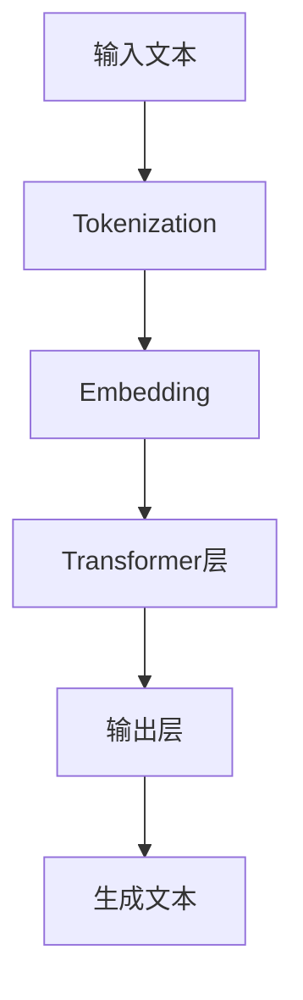
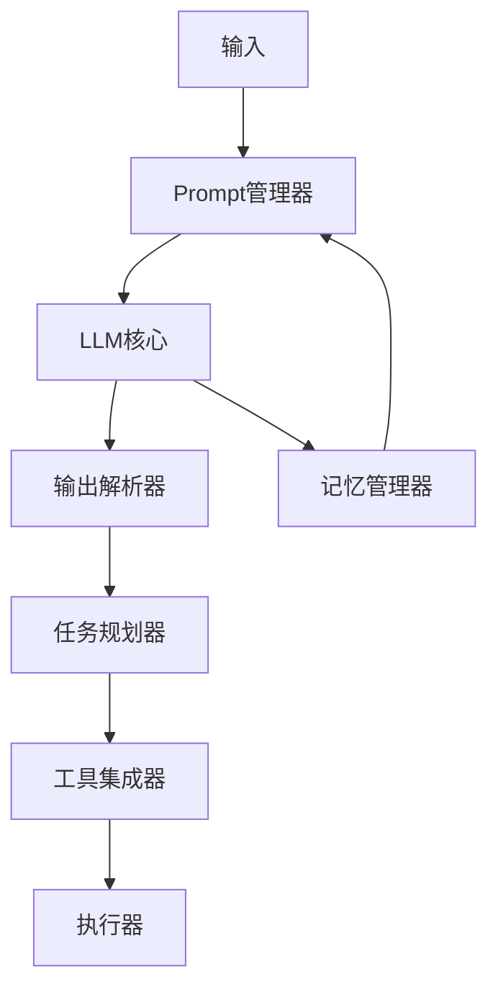

# 3: LLM赋能的Agent

在前两章中，我们了解了Agent的基本概念和核心组成部分。现在，让我们探讨一个激动人心的话题：大语言模型（Large Language Models，简称LLM）如何赋能Agent，使其能力达到一个新的高度。

3.1 LLM的基本概念

首先，让我们简要回顾一下什么是大语言模型。

大语言模型是一种基于深度学习的自然语言处理模型，它通过在海量文本数据上训练，学习到了语言的统计规律和世界知识。典型的LLM包括GPT系列、BERT、T5等。这些模型通常有以下特点：

1. 规模庞大：通常包含数十亿到数千亿个参数。
2. 自监督学习：主要通过预测下一个词或填充缺失的词来学习。
3. 通用性强：可以适应多种不同的自然语言处理任务。
4. 上下文学习能力：能够根据给定的上下文快速适应新任务。

让我们用一个简单的图表来展示LLM的基本工作原理：



3.2 LLM如何增强Agent能力

LLM为Agent带来了革命性的变化，主要体现在以下几个方面：

1. 增强自然语言理解和生成能力
LLM使Agent能够更好地理解人类的指令和环境描述，并生成更自然、更符合上下文的响应。例如，GPT-3能够理解复杂的多轮对话，并生成连贯的回复。
2. 提供丰富的知识库
LLM在预训练过程中学习了大量的世界知识。这使得Agent无需显式的知识图谱，就能回答各种领域的问题。例如，LLM-based Agent可以回答历史、科学、文化等各种主题的问题。
3. 增强推理和规划能力
通过prompt engineering，LLM展现出了强大的推理和规划能力。例如，Chain-of-Thought prompting使LLM能够一步步地解决复杂问题。
4. 提高适应性和泛化能力
LLM的few-shot learning能力使Agent能够快速适应新任务，无需大量的特定任务训练数据。
5. 增强多模态处理能力
最新的LLM（如GPT-4）具备处理图像等多模态输入的能力，这大大拓展了Agent的感知范围。

让我们用一个代码示例来展示LLM如何增强Agent的能力：

```python
class LLMEnhancedAgent:
    def __init__(self, llm):
        self.llm = llm
        self.memory = []

    def perceive(self, input_data):
        # 将输入数据转换为文本描述
        text_description = self.convert_to_text(input_data)
        return text_description

    def decide(self, perception):
        # 构建prompt
        prompt = f"Based on the following perception: {perception}\\n"
        prompt += f"And considering the previous context: {self.memory[-5:]}\\n"
        prompt += "What should be the next action? Please think step by step."

        # 使用LLM生成决策
        decision = self.llm.generate(prompt)
        return decision

    def act(self, decision):
        # 将决策转换为具体行动
        action = self.convert_to_action(decision)
        return action

    def update_memory(self, perception, decision, action):
        self.memory.append(f"Perceived: {perception}")
        self.memory.append(f"Decided: {decision}")
        self.memory.append(f"Acted: {action}")

    def run(self, environment):
        while not environment.is_done():
            input_data = environment.get_state()
            perception = self.perceive(input_data)
            decision = self.decide(perception)
            action = self.act(decision)
            environment.step(action)
            self.update_memory(perception, decision, action)

```

这个`LLMEnhancedAgent`类展示了LLM如何参与Agent的决策过程。它利用LLM的强大能力来理解环境、做出决策，并保持上下文的连贯性。

3.3 基于LLM的Agent架构

基于LLM的Agent架构通常包含以下几个关键组件：

1. LLM核心：作为Agent的中央处理单元，负责理解、推理和生成。
2. Prompt管理器：负责构建有效的prompt，以引导LLM产生所需的输出。
3. 工具集成器：允许Agent调用外部工具和API，扩展其能力范围。
4. 记忆管理器：管理短期和长期记忆，提供上下文信息。
5. 任务规划器：分解复杂任务，制定执行计划。

让我们用一个图表来展示这种架构：



3.4 LLM-Agent的优势与局限

优势：

1. 强大的语言理解和生成能力
2. 丰富的知识库
3. 强大的推理和规划能力
4. 高度的灵活性和适应性
5. 多模态处理能力

局限：

1. 幻觉问题：LLM可能会生成看似合理但实际上不正确的信息。
2. 偏见问题：LLM可能会复制训练数据中的偏见。
3. 一致性问题：LLM的输出可能在不同运行之间不一致。
4. 计算资源需求大：运行大型LLM需要大量计算资源。
5. 隐私问题：LLM可能无意中泄露训练数据中的敏感信息。

为了应对这些局限，研究人员提出了various机制。例如，为了解决幻觉问题，我们可以使用以下策略：

1. 事实检查：使用外部知识库验证LLM的输出。
2. 不确定性估计：让LLM评估自己答案的确定性。
3. 多模型集成：使用多个模型的输出，取得更可靠的结果。

以下是一个简单的代码示例，展示如何实现基本的事实检查：

```python
class FactCheckingAgent:
    def __init__(self, llm, knowledge_base):
        self.llm = llm
        self.knowledge_base = knowledge_base

    def generate_answer(self, question):
        # 使用LLM生成答案
        answer = self.llm.generate(question)

        # 检查答案
        fact_check_result = self.fact_check(question, answer)

        if fact_check_result['is_correct']:
            return answer
        else:
            return f"I'm not sure, but I think {answer}. However, according to my knowledge base, {fact_check_result['correction']}."

    def fact_check(self, question, answer):
        # 在知识库中查找相关信息
        relevant_info = self.knowledge_base.query(question)

        # 使用LLM来比较答案和知识库信息
        prompt = f"Question: {question}\\nMy answer: {answer}\\nKnowledge base info: {relevant_info}\\nIs my answer correct? If not, what's the correct answer?"
        check_result = self.llm.generate(prompt)

        # 解析检查结果
        is_correct = "yes" in check_result.lower()
        correction = check_result if not is_correct else ""

        return {'is_correct': is_correct, 'correction': correction}

```

这个`FactCheckingAgent`展示了如何结合知识库和LLM来进行基本的事实检查，以减少幻觉问题的影响。

总结一下，LLM为Agent带来了革命性的变化，极大地增强了Agent的能力。然而，我们也需要认识到LLM-Agent的局限性，并积极寻找解决方案。在未来，随着LLM技术的不断进步，我们可以期待看到更加强大和可靠的LLM-Agent。

在下一章中，我们将探讨Agent的各种应用场景，看看这些强大的LLM-Agent如何在实际中发挥作用。让我们一起期待下一章的内容！