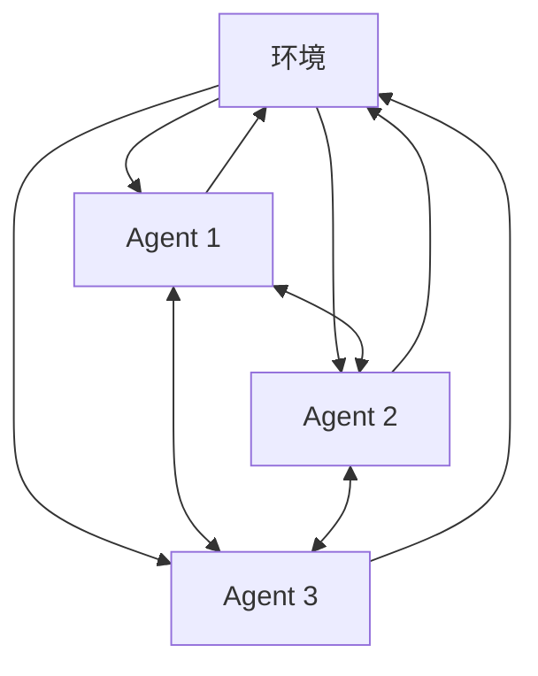

# 5: 多Agent系统与交互

在前面的章节中，我们探讨了单个Agent的结构、能力和应用场景。然而，在现实世界中，很多复杂的问题需要多个Agent协同工作才能解决。本章我们将讨论多Agent系统，探索Agent之间如何互动、协作和竞争。

5.1 多Agent系统概述

多Agent系统（Multi-Agent Systems，MAS）是由多个相互作用的智能Agent组成的系统。这些Agent可能有相同或不同的能力，可能合作也可能竞争，共同解决复杂的问题或模拟复杂的场景。

多Agent系统的主要特点包括：

1. 分布式：每个Agent都是独立的实体，可以并行运行。
2. 自主性：每个Agent都能独立做出决策。
3. 社会性：Agent之间能够相互交流和影响。
4. 适应性：系统可以根据环境变化调整行为。

让我们用一个简单的图表来展示多Agent系统的基本结构：



这个图表展示了多个Agent如何在同一环境中相互作用，既影响环境也相互影响。

5.2 Agent间的协作模式

在多Agent系统中，协作是一种常见且重要的交互模式。通过协作，Agent可以完成单个Agent无法完成的复杂任务。

5.2.1 无序协作

无序协作是指Agent之间没有预定义的交互顺序或结构，每个Agent都可以自由地表达观点和提供建议。这种模式类似于人类的头脑风暴过程。

例如，考虑一个由多个Agent组成的问题解决系统：

```python
class ProblemSolvingSystem:
    def __init__(self, agents):
        self.agents = agents

    def solve_problem(self, problem):
        solutions = []
        for agent in self.agents:
            solution = agent.propose_solution(problem)
            solutions.append(solution)

        best_solution = self.evaluate_solutions(solutions)
        return best_solution

    def evaluate_solutions(self, solutions):
        # 这里可以使用投票、加权平均等方法
        return max(solutions, key=lambda s: s.score)

```

在这个系统中，每个Agent都提出自己的解决方案，然后系统选择最佳方案。这种方法的优点是可以产生多样化的解决方案，缺点是可能需要额外的协调机制来整合不同的意见。

5.2.2 有序协作

有序协作是指Agent按照预定义的顺序或结构进行交互。这种模式通常用于需要严格控制的场景，如软件开发流程。

让我们看一个软件开发团队的例子：

```python
class SoftwareDevelopmentTeam:
    def __init__(self, product_manager, designer, developer, tester):
        self.product_manager = product_manager
        self.designer = designer
        self.developer = developer
        self.tester = tester

    def develop_product(self, requirements):
        # 产品经理分析需求
        specs = self.product_manager.analyze_requirements(requirements)

        # 设计师创建设计
        design = self.designer.create_design(specs)

        # 开发者实现功能
        code = self.developer.implement(design)

        # 测试人员进行测试
        test_results = self.tester.test(code)

        if test_results.passed:
            return code
        else:
            # 如果测试未通过，返回开发阶段
            return self.develop_product(test_results.feedback)

```

在这个例子中，每个Agent都有明确的角色和职责，它们按照预定义的顺序协作完成软件开发任务。

5.3 Agent间的竞争与博弈

除了协作，Agent之间也可能存在竞争关系。竞争可以推动Agent不断改进自己的策略，提高整体系统的性能。

5.3.1 零和博弈

在零和博弈中，一个Agent的收益必然意味着其他Agent的损失。典型的例子是下棋游戏。

让我们看一个简化的象棋AI系统：

```python
class ChessGame:
    def __init__(self, player1, player2):
        self.players = [player1, player2]
        self.board = self.initialize_board()

    def play(self):
        current_player = 0
        while not self.is_game_over():
            move = self.players[current_player].make_move(self.board)
            self.apply_move(move)
            current_player = 1 - current_player

        return self.get_winner()

    def is_game_over(self):
        # 检查游戏是否结束
        pass

    def apply_move(self, move):
        # 在棋盘上应用移动
        pass

    def get_winner(self):
        # 确定赢家
        pass

```

在这个系统中，两个AI Agent轮流在棋盘上移动棋子，每个Agent都试图击败对手。这种竞争推动了象棋AI的不断进步。

5.3.2 非零和博弈

在非零和博弈中，Agent之间既有竞争也有合作的机会。一个典型的例子是"囚徒困境"。

让我们实现一个多轮囚徒困境的模拟：

```python
class PrisonersDilemma:
    def __init__(self, agent1, agent2, rounds):
        self.agents = [agent1, agent2]
        self.rounds = rounds
        self.scores = [0, 0]

    def play(self):
        for _ in range(self.rounds):
            actions = [agent.choose_action() for agent in self.agents]
            self.update_scores(actions)
            for i, agent in enumerate(self.agents):
                agent.update_strategy(actions[i], actions[1-i])

        return self.scores

    def update_scores(self, actions):
        if actions == ['cooperate', 'cooperate']:
            self.scores = [s + 3 for s in self.scores]
        elif actions == ['defect', 'defect']:
            self.scores = [s + 1 for s in self.scores]
        elif actions == ['cooperate', 'defect']:
            self.scores[0] += 0
            self.scores[1] += 5
        else:  # ['defect', 'cooperate']
            self.scores[0] += 5
            self.scores[1] += 0

```

在这个系统中，Agent需要权衡是否合作。虽然双方都选择背叛可以避免最坏的结果，但双方合作才能获得最大的总体收益。这种情况下，Agent需要学会在竞争和合作之间找到平衡。

5.4 多Agent系统的emergent behavior

Emergent behavior（涌现行为）是指从简单规则的交互中产生的复杂行为模式。在多Agent系统中，尽管每个Agent可能只遵循简单的规则，但它们的集体行为可能会表现出令人惊讶的复杂性和智能。

一个经典的例子是群体行为模拟，如鸟群飞行。每只鸟（Agent）只需遵循几个简单的规则：

1. 分离：避免与邻近的鸟相撞
2. 对齐：与邻近的鸟保持相同的方向
3. 内聚：向邻近鸟群的平均位置移动

让我们实现一个简单的群体行为模拟：

```python
import numpy as np

class Bird:
    def __init__(self, x, y, vx, vy):
        self.position = np.array([x, y])
        self.velocity = np.array([vx, vy])

    def update(self, flock):
        separation = self.separate(flock)
        alignment = self.align(flock)
        cohesion = self.cohere(flock)

        self.velocity += separation + alignment + cohesion
        self.position += self.velocity

    def separate(self, flock):
        # 实现分离行为
        pass

    def align(self, flock):
        # 实现对齐行为
        pass

    def cohere(self, flock):
        # 实现内聚行为
        pass

class Flock:
    def __init__(self, n_birds):
        self.birds = [Bird(np.random.rand(), np.random.rand(),
                           np.random.rand(), np.random.rand())
                      for _ in range(n_birds)]

    def update(self):
        for bird in self.birds:
            bird.update(self)

    def simulate(self, steps):
        for _ in range(steps):
            self.update()

```

这个简单的模型可以产生类似真实鸟群的复杂飞行模式，展示了emergent behavior的强大之处。

在多Agent系统中，我们经常可以观察到类似的涌现行为。例如，在多Agent交通系统中，我们可能会看到交通流的自组织行为；在多Agent经济模型中，我们可能会看到市场价格的自发形成。这些涌现行为为我们理解复杂系统提供了宝贵的洞察。

多Agent系统为我们提供了一种强大的工具，用于解决复杂问题和模拟复杂场景。通过协作、竞争和涌现行为，多Agent系统可以展现出单个Agent无法达到的智能和复杂性。随着技术的进步，特别是LLM的发展，我们可以期待看到更加智能和灵活的多Agent系统的出现。