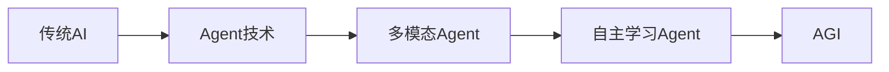

# 7: Agent的未来发展与挑战

在前面的章节中，我们已经深入探讨了Agent的基本概念、核心组成、LLM的赋能、应用场景、多Agent系统以及Agent社会模拟。现在，让我们把目光投向未来，思考Agent技术的发展方向和可能面临的挑战。

7.1 Agent与AGI

人工通用智能（Artificial General Intelligence, AGI）一直是AI研究的终极目标。AGI指的是能够理解、学习并执行任何智力任务的AI系统，其智能水平应该与人类相当或超越人类。那么，Agent技术与AGI之间有什么关系呢？

1. Agent作为AGI的雏形

当前的Agent技术，特别是基于大语言模型的Agent，已经展现出了某些AGI的特征：

- 通用性：能够处理各种不同领域的任务
- 学习能力：能够从经验中学习，适应新环境
- 推理能力：能够进行复杂的推理和规划
- 交互能力：能够与人类进行自然语言交互

让我们用一个简单的图表来表示Agent向AGI演进的可能路径：



1. 从Agent到AGI的挑战

然而，从当前的Agent技术到真正的AGI，还有很长的路要走。主要挑战包括：

- 常识推理：虽然LLM在某些推理任务上表现出色，但在需要常识的场景中仍然经常出错。
- 因果理解：当前的Agent主要基于相关性学习，缺乏对因果关系的深入理解。
- 持续学习：如何在不忘记已学知识的前提下持续学习新知识。
- 自主目标设定：真正的AGI应该能够自主设定和调整目标。

让我们通过一个例子来说明当前Agent在常识推理方面的局限性：

```python
class AGIAgent:
    def __init__(self, llm):
        self.llm = llm

    def reason(self, question):
        prompt = f"Question: {question}\\nLet's approach this step-by-step:"
        response = self.llm.generate(prompt)
        return response

    def test_common_sense(self):
        questions = [
            "If I put a glass of water in a freezer, what will happen after a few hours?",
            "Why can't a person walk through a wall?",
            "If I drop a feather and a hammer at the same time on the moon, which will land first?"
        ]
        for q in questions:
            print(f"Q: {q}")
            print(f"A: {self.reason(q)}")
            print()

# 使用这个类
agi_agent = AGIAgent(some_llm)
agi_agent.test_common_sense()

```

虽然LLM可能会给出看似合理的答案，但它可能无法真正理解物理定律或因果关系。这表明我们在追求AGI的道路上还有很长的路要走。

7.2 Agent的伦理与安全问题

随着Agent技术的不断发展，其伦理和安全问题也日益凸显。

1. 伦理问题
- 决策偏见：如果训练数据存在偏见，Agent可能会做出有偏见的决策。
- 隐私保护：Agent可能会处理大量个人数据，如何保护用户隐私？
- 责任归属：当Agent做出错误决策时，谁应该负责？
- 失业问题：Agent可能会取代某些工作，如何应对可能的失业问题？
1. 安全问题
- 系统脆弱性：Agent可能被黑客攻击或被恶意利用。
- 失控风险：如果Agent获得了过高的自主权，可能会做出不可预测的行为。
- 数据安全：Agent处理的敏感数据如何保护？

让我们设计一个简单的框架来评估Agent的伦理风险：

```python
class EthicsEvaluator:
    def __init__(self):
        self.criteria = {
            'bias': self.check_bias,
            'privacy': self.check_privacy,
            'transparency': self.check_transparency,
            'accountability': self.check_accountability
        }

    def evaluate(self, agent):
        results = {}
        for criterion, check_function in self.criteria.items():
            results[criterion] = check_function(agent)
        return results

    def check_bias(self, agent):
        # 检查决策是否存在偏见
        pass

    def check_privacy(self, agent):
        # 检查是否充分保护用户隐私
        pass

    def check_transparency(self, agent):
        # 检查决策过程是否透明
        pass

    def check_accountability(self, agent):
        # 检查是否有明确的责任归属机制
        pass

# 使用这个评估器
evaluator = EthicsEvaluator()
ethics_score = evaluator.evaluate(some_agent)

```

这个框架可以帮助我们系统地评估Agent的伦理风险，并采取相应的措施来改进。

7.3 Agent技术的产业化前景

Agent技术的快速发展为多个产业带来了新的机遇。

1. 智能助手

个人助理、客户服务、教育辅导等领域都可以应用Agent技术。例如：

```python
class PersonalAssistantAgent:
    def __init__(self, llm, user_profile):
        self.llm = llm
        self.user_profile = user_profile

    def schedule_meeting(self, participants, duration):
        # 查看日程安排合适的时间
        pass

    def summarize_emails(self):
        # 总结重要邮件
        pass

    def provide_recommendations(self, category):
        # 根据用户兴趣提供推荐
        pass

```

1. 智能决策支持

在金融、医疗、管理等领域，Agent可以辅助人类做出更好的决策。

1. 自动化流程

Agent可以自动化许多复杂的工作流程，提高效率。

1. 游戏与娱乐

在游戏中，Agent可以作为NPC（非玩家角色）提供更真实、更丰富的交互体验。

1. 科研辅助

Agent可以协助科研人员进行文献综述、实验设计、数据分析等工作。

7.4 Agent研究的未来方向

1. 多模态感知与交互

未来的Agent应该能够理解和生成多种模态的信息，包括文本、图像、语音、视频等。

```python
class MultimodalAgent:
    def __init__(self, text_model, vision_model, audio_model):
        self.text_model = text_model
        self.vision_model = vision_model
        self.audio_model = audio_model

    def perceive(self, input_data):
        if isinstance(input_data, str):
            return self.text_model.process(input_data)
        elif isinstance(input_data, Image):
            return self.vision_model.process(input_data)
        elif isinstance(input_data, Audio):
            return self.audio_model.process(input_data)

    def generate(self, output_type, content):
        if output_type == 'text':
            return self.text_model.generate(content)
        elif output_type == 'image':
            return self.vision_model.generate(content)
        elif output_type == 'speech':
            return self.audio_model.generate(content)

```

1. 自主学习与知识更新

Agent应该能够持续学习，自主更新自己的知识库。

1. 可解释性研究

提高Agent决策过程的透明度和可解释性，使用户能够理解和信任Agent的决策。

1. 情感和社交智能

使Agent能够理解和表达情感，更好地与人类互动。

1. 跨领域知识整合

Agent应该能够整合不同领域的知识，做出更全面的决策。

结语：

Agent技术正站在一个激动人心的十字路口。它既面临着巨大的机遇，也面临着严峻的挑战。从某种程度上说，Agent技术的发展反映了我们对人工智能的理解和期望。我们期待Agent能像人类一样思考、学习和行动，但同时又希望它们能超越人类的局限性。

未来的Agent可能会更加智能、更加自主、更加普遍。它们可能会成为我们生活中不可或缺的一部分，协助我们工作、学习、决策，甚至成为我们的朋友和伙伴。但与此同时，我们也需要谨慎地思考Agent技术可能带来的伦理和社会影响，确保它的发展方向与人类的价值观和利益相一致。