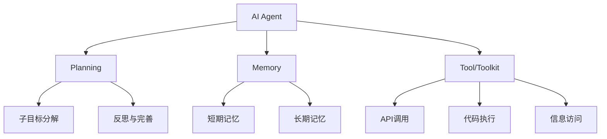
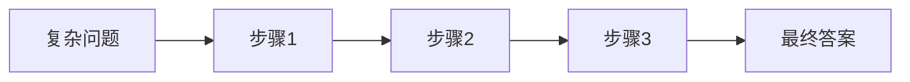
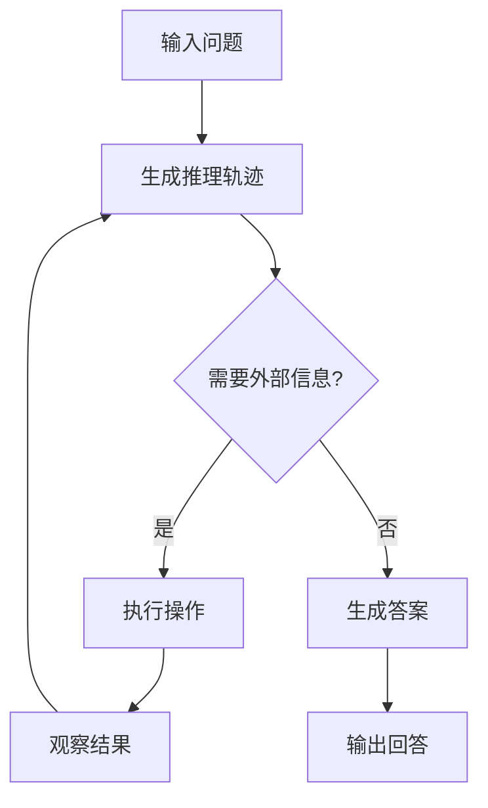

# 3. 深入探索AI Agent: 从理论到实践

在人工智能快速发展的今天,AI Agent作为一种新兴的智能系统范式正受到越来越多的关注。本文将深入探讨AI Agent的核心概念、思考框架以及实际构建过程,帮助读者全面了解这一前沿技术。

## AI Agent的本质

AI Agent的核心思想是利用语言模型作为推理引擎,来选择和执行一系列行动以完成特定任务。与传统的"输入-输出"模式不同,Agent更强调自主性,能够主动发现问题、确定目标、构想和选择方案、执行计划并进行自我检查和更新。因此,Agent被视为具有"自主智能"的实体。

要理解AI Agent,我们可以将其框架拆解为三个主要组件:

1. Planning (规划)
2. Memory (记忆)
3. Tool/Toolkit (工具)

这种拆分方式借鉴了LangChain等知名Agent框架的设计理念。当然,理解Agent还有其他视角,如Baby Agent、AutoGPT等。感兴趣的读者可以进一步探索这些框架。

让我们用一个图表来直观展示AI Agent的基本架构:



### Planning (规划)

规划模块赋予了Agent处理复杂任务的能力:

- 子目标分解: Agent能将大型任务拆解为更小、更易管理的子目标。
- 反思和完善: Agent可以对过去的行为进行自我批评和反思,从错误中学习并不断改进未来的行动计划。

### Memory (记忆)

记忆系统使Agent能够保存和利用信息:

- 短期记忆: 利用上下文学习,实现即时的信息处理。
- 长期记忆: 通过外部向量存储和快速检索,实现大量信息的长期保留和调用。

### Tool/Toolkit (工具)

工具使Agent能够获取外部信息和执行特定操作:

- 调用外部API获取实时信息
- 执行代码
- 访问专有信息源

这些工具极大地扩展了Agent的能力边界,使其不再局限于预训练数据。

## AI Agent的思考框架

要构建高效的AI Agent,关键在于设计合适的思考框架。目前,主流的思考框架包括Chain of Thought (CoT)和Reasoning and Acting (ReAct)。

### Chain of Thought (CoT)

CoT的核心理念是通过逐步推理来解决复杂问题。2022年,Google在论文《Chain-of-Thought Prompting Elicits Reasoning in Large Language Models》中首次提出这一概念。CoT通过让大语言模型(LLM)将复杂问题分解为一系列子问题并逐步求解,显著提升了模型的推理能力。

使用CoT的方法相对简单:

- 对于Zero-Shot场景,只需在Prompt末尾添加:
    
    ```
    Let's think step by step
    
    ```
    
- 对于One-Shot或Few-Shot场景,需要在Prompt中提供一些示例。

CoT的应用效果示意图:



值得注意的是,CoT技术正在不断演进,衍生出了多种复杂的链式思考方式。

### Reasoning and Acting (ReAct)

ReAct框架在CoT的基础上更进一步,将推理与行动相结合。2022年,Yao等人在论文中引入了这一框架,其核心是让LLM以交错的方式生成推理轨迹和任务特定操作。

ReAct的工作流程如下:

1. 生成推理轨迹,用于制定、跟踪和更新行动计划。
2. 执行操作步骤,与外部环境(如知识库)交互并收集信息。
3. 整合内部知识和外部信息,进行下一轮推理。

这种方法使LLM能够与外部工具交互,获取额外信息,从而提供更可靠和实用的回应。研究表明,ReAct在语言和决策任务上的表现优于多个最先进的基准方法,同时提高了LLM的可解释性和可信度。

ReAct的运作机制可以用以下流程图表示:



使用ReAct框架的常用Prompt模板如下:

```python
Answer the following questions as best you can. You have access to the following tools: {tools}

Use the following format:

Question: the input question you must answer
Thought: you should always think about what to do
Action: the action to take, should be one of [{tool_names}]
Action Input: the input to the action
Observation: the result of the action
... (this Thought/Action/Action Input/Observation can repeat N times)
Thought: I now know the final answer
Final Answer: the final answer to the original input question

Begin!

Question: {input}
Thought:{agent_scratchpad}

```

## 构建ReAct框架的AI Agent

现在,让我们一步步实现一个基于ReAct框架的AI Agent。我们将从简单的硬编码开始,逐步完善各个组件。

### 1. 简单的ReAct实现

首先,我们为大语言模型提供一个简单的工具`get_word_length`,并使用ReAct框架解决基本问题。

System Prompt:

```
Answer the following questions as best you can. You have access to the following tools:

get_word_length(word: str) -> int:
    """Returns the length of a word."""

Use the following format:

Question: the input question you must answer
Thought: you should always think about what to do
Action: the action to take, should be one of [get_word_length]
Action Input: the input to the action
Observation: the result of the action
... (this Thought/Action/Action Input/Observation can repeat N times)
Thought: I now know the final answer
Final Answer: the final answer to the original input question

Begin!

```

User Input:

```
Question: How many letters in the word educa

```

运行结果:

```
Thought: To determine how many letters are in the word "educa", I need to use the get_word_length tool.

Action: get_word_length
Action Input: educa

Observation: 5

Thought: The get_word_length tool returned 5, which means there are 5 letters in the word "educa".

Final Answer: There are 5 letters in the word "educa".

```

这个简单的例子展示了ReAct框架的基本工作流程。然而,我们注意到Agent在使用工具时可能会出现参数不匹配的问题。这提醒我们需要更精确地描述工具的使用方法。

### 2. 实现Agent类

Agent是整个框架的核心,负责推理和决策。我们可以将其实现为一个封装了大语言模型的类:

```tsx
class LLMSingleActionAgent {
  llm: AzureLLM
  tools: StructuredTool[]
  stop: string[]
  private _prompt: string = '{input}'

  constructor({ llm, tools = [], stop = [] }: LLMSingleActionAgentParams) {
    this.llm = llm
    this.tools = tools
    if (stop.length > 4)
      throw new Error('up to 4 stop sequences')
    this.stop = stop
  }

  // 其他方法...
}

```

这个类封装了LLM的API,并管理可用的工具和停止序列。

### 3. 实现Tool类

工具是Agent可以调用的外部功能。我们可以创建一个抽象的`StructuredTool`类作为所有工具的基类:

```tsx
export abstract class StructuredTool {
  name: string
  description: string

  constructor(name: string, description: string) {
    this.name = name
    this.description = description
  }

  abstract call(arg: string, config?: Record<string, any>): Promise<string>

  getSchema(): string {
    return `${this.declaration} | ${this.name} | ${this.description}`
  }

  abstract get declaration(): string
}

```

这个类定义了工具的基本结构,包括名称、描述和调用方法。`getSchema`方法返回工具的文本描述,用于在Prompt中介绍工具。

### 4. 实现Executor类

Executor是Agent的运行时,协调各个组件并指导操作:

```tsx
class AgentExecutor {
  agent: LLMSingleActionAgent
  tools: StructuredTool[] = []
  maxIterations: number = 15

  constructor(agent: LLMSingleActionAgent) {
    this.agent = agent
  }

  addTool(tools: StructuredTool | StructuredTool[]) {
    const _tools = Array.isArray(tools) ? tools : [tools]
    this.tools.push(..._tools)
  }

  async call(input: promptInputs): Promise<AgentFinish> {
    // 实现执行循环...
  }
}

```

`call`方法实现了Agent的核心执行循环,包括规划、执行工具、观察结果和迭代这个过程,直到达成目标或达到最大迭代次数。

### 5. 运行示例

最后,让我们看一个完整的运行示例,使用加减乘除四个工具来解决一个复杂的数学问题:

```tsx
describe('agent', () => {
  const llm = new AzureLLM({
    apiKey: Config.apiKey,
    model: Config.model,
  })
  const agent = new LLMSingleActionAgent({ llm })
  agent.setPrompt(REACT_PROMPT)
  agent.addStop(agent.observationPrefix)
  agent.addTool([new AdditionTool(), new SubtractionTool(), new DivisionTool(), new MultiplicationTool()])
  const executor = new AgentExecutor(agent)
  executor.addTool([new AdditionTool(), new SubtractionTool(), new DivisionTool(), new MultiplicationTool()])

  it('test', async () => {
    const res = await executor.call({ input: '一种减速机的价格是750元，一家企业需要购买12台。每台减速机运行一小时的电费是0.5元，企业每天运行这些减速机8小时。请计算企业购买及一周运行这些减速机的总花费。' })
    expect(res).toMatchInlineSnapshot(`
      {
        "log": "Final Answer: The total cost of purchasing and operating the gearboxes for a week is 9336 yuan.",
        "returnValues": {
          "output": "The total cost of purchasing and operating the gearboxes for a week is 9336 yuan.",
        },
      }
    `)
  }, { timeout: 50000 })
})

```

这个例子展示了如何使用我们构建的ReAct框架来解决一个多步骤的数学问题。Agent成功地分解了问题,使用提供的工具进行计算,并得出了正确的结果。

## 未来改进方向

尽管我们已经实现了一个基本的ReAct框架,但仍有许多可以改进的地方:

1. 处理Agent选择不存在工具的情况
2. 引入更复杂的记忆系统
3. 实现多Agent协作
4. 设计更复杂的工具,支持在一个Action中调用多个工具
5. 处理工具执行错误的情况
6. 处理Agent生成无法解析为工具调用的输出的情况
7. 在所有级别(Agent决策、工具调用)实现详细的日志记录和可观察性

## 结论

AI Agent技术represents一个令人兴奋的AI应用领域。通过结合大语言模型的推理能力和外部工具的实用功能,Agent可以执行复杂的任务序列,展现出类似人类的问题解决能力。ReAct框架为构建这样的Agent提供了一个强大的基础,让我们能够创造出更智能、更灵活的AI系统。

随着技术的不断发展,我们可以期待看到更多创新的Agent应用,比如AIWAVES的[Agents框架](https://github.com/aiwaves-cn/agents)和清华大学的XAgent等。这些进展无疑将推动AI向着更高级的智能形态演进。

本文通过深入剖析AI Agent的核心概念、实现方法和实际示例,希望能为读者提供一个全面的技术视角。在未来的AI生态中,Agent技术必将发挥越来越重要的作用,持续关注和探索这一领域将是极具价值的。