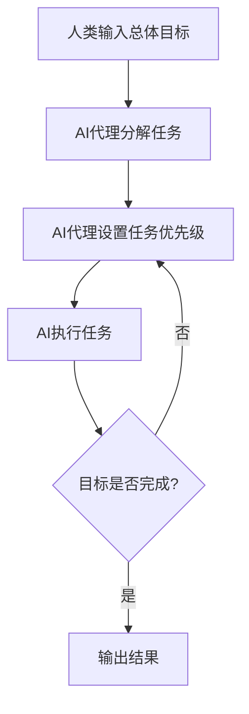

# 4. 自主AI代理:未来的生产力革命

牛顿曾说:"如果说我看得更远,那是因为我站在巨人的肩膀上。"在现代,这些"巨人"可能就是自主的开源AI代理,它们正在为我们承担重要的工作。

## 目录

1. [什么是自主代理?](notion://www.notion.so/3-AI-Agent-7e02559644af4d4e9184087b02df69f1?p=fdd2ae5437404610bae48797c2138f38&showMoveTo=true#%E4%BB%80%E4%B9%88%E6%98%AF%E8%87%AA%E4%B8%BB%E4%BB%A3%E7%90%86)
2. [顶级开源自主代理](notion://www.notion.so/3-AI-Agent-7e02559644af4d4e9184087b02df69f1?p=fdd2ae5437404610bae48797c2138f38&showMoveTo=true#%E9%A1%B6%E7%BA%A7%E5%BC%80%E6%BA%90%E8%87%AA%E4%B8%BB%E4%BB%A3%E7%90%86)
3. [自主代理在任务管理中的作用](notion://www.notion.so/3-AI-Agent-7e02559644af4d4e9184087b02df69f1?p=fdd2ae5437404610bae48797c2138f38&showMoveTo=true#%E8%87%AA%E4%B8%BB%E4%BB%A3%E7%90%86%E5%9C%A8%E4%BB%BB%E5%8A%A1%E7%AE%A1%E7%90%86%E4%B8%AD%E7%9A%84%E4%BD%9C%E7%94%A8)
4. [自主代理的挑战与考虑因素](notion://www.notion.so/3-AI-Agent-7e02559644af4d4e9184087b02df69f1?p=fdd2ae5437404610bae48797c2138f38&showMoveTo=true#%E8%87%AA%E4%B8%BB%E4%BB%A3%E7%90%86%E7%9A%84%E6%8C%91%E6%88%98%E4%B8%8E%E8%80%83%E8%99%91%E5%9B%A0%E7%B4%A0)
5. [自主化的未来:前景展望](notion://www.notion.so/3-AI-Agent-7e02559644af4d4e9184087b02df69f1?p=fdd2ae5437404610bae48797c2138f38&showMoveTo=true#%E8%87%AA%E4%B8%BB%E5%8C%96%E7%9A%84%E6%9C%AA%E6%9D%A5%E5%89%8D%E6%99%AF%E5%B1%95%E6%9C%9B)
6. [常见问题解答](notion://www.notion.so/3-AI-Agent-7e02559644af4d4e9184087b02df69f1?p=fdd2ae5437404610bae48797c2138f38&showMoveTo=true#%E5%B8%B8%E8%A7%81%E9%97%AE%E9%A2%98%E8%A7%A3%E7%AD%94)

在本文中,我们将探讨一些最优秀的开源AI代理和多代理框架,这些工具可以应用于个人和商业用途。我们还将深入分析代理架构带来的机遇、挑战和未知领域。您将了解到:

- 开源AI代理如何为创新和效率创造机会
- 哪些多代理框架为您的项目提供最佳功能
- 何时最适合实施AI代理来解决实际问题
- 自主代理将如何影响AI驱动的任务管理
- 以及更多内容...

## 什么是自主代理?

像ChatGPT、DALL-E 3或Midjourney这样的工具使用基于提示的界面进行人机交互。这意味着您需要用自然语言编写一组指令(通常伴随着大量的重新提示尝试)才能获得有意义的响应。

考虑到AI模型的能力,这种方式显得缓慢且不直观。虽然类似Neuralink的脑机接口技术还需要一段时间,但我们现在就需要更好、更高效的方式来与人工智能进行交互。

那么,什么是AI代理呢?

自主代理(或简称AI代理)扮演着AI的任务主管角色。它们是简单的应用程序,以自我导向的循环方式工作,为AI设置、优先排序和重新排序任务,直到完成总体目标。结果?一个(相对)免提的AI体验。

> 💡 AI代理小知识: 自主AI代理的概念源于Untapped Capital的普通合伙人Yohei Nakajima于2023年初发表的一篇题为"Task-Driven Autonomous Agent"的论文。
> 

代理架构在2023年3月诞生,但直到几个月后才在开源社区中得到广泛关注。虽然代理领域可能仍然看起来像一种"疯狂科学家"式的实验,但已经有一些非常强大的模型可供尝试。

## 顶级开源自主代理

### 1. AutoGPT

AutoGPT由视频游戏公司Significant Gravitas Ltd.的创始人Toran Bruce Richards开发,是2023年3月Nakajima论文发表后推出的早期代理之一。它也是目前GitHub上最受欢迎的代理存储库。

AutoGPT的理念很简单 - 它是一个用于构建和运行各种项目的自定义AI代理的完整工具包。该工具使用OpenAI的GPT-4和GPT-3.5大型语言模型(LLM),允许您为各种个人和商业项目构建代理。

**GitHub仓库**: [https://github.com/Significant-Gravitas/AutoGPT](https://github.com/Significant-Gravitas/AutoGPT)

### 2. BabyAGI

BabyAGI是Nakajima的任务驱动自主代理的简化版本。这个Python脚本只有140行代码,根据官方GitHub仓库的说明,"使用OpenAI和向量数据库(如Chroma或Weaviate)来创建、优先排序和执行任务。"

自推出以来,BabyAGI已经衍生出几个有趣的项目。例如twitter-agent🐣或BabyAGI on Slack将代理的力量带到了现有平台。其他项目则添加了插件和额外功能,或将BabyAGI移植到其他语言(如babyagi-perl)。

**GitHub仓库**: [https://github.com/yoheinakajima/babyagi](https://github.com/yoheinakajima/babyagi)

### 3. SuperAGI

SuperAGI是AutoGPT的一个更灵活、更用户友好的替代方案。可以将其视为开源AI代理的发射台,它提供了构建、维护和运行自己的代理所需的一切。这还包括插件和云版本,您可以在其中测试各种功能。

该框架具有多个AI模型、图形用户界面、与向量数据库的集成(用于存储/检索数据)以及性能洞察。还有一个市场,提供可以将其连接到Google Analytics等流行应用程序和服务的工具包。

**GitHub仓库**: [https://github.com/TransformerOptimus/SuperAGI](https://github.com/TransformerOptimus/SuperAGI)

### 4. ShortGPT

AI模型在生成内容方面表现出色。但直到最近,视频格式在很大程度上还未得到充分服务。ShortGPT是一个框架,允许您使用大型语言模型来简化视频创建、语音合成和编辑等复杂任务。

ShortGPT可以处理大多数典型的视频相关任务,如编写视频脚本、生成配音、选择背景音乐、编写标题和描述,甚至编辑视频。该工具适用于短视频和长视频内容,无论平台如何。

**GitHub仓库**: [https://github.com/RayVentura/ShortGPT](https://github.com/RayVentura/ShortGPT)

### 5. ChatDev

CoPilot、Bard、ChatGPT等都是强大的编码助手。但像ChatDev这样的项目可能很快就会给它们带来竞争。被称为"虚拟软件公司"的ChatDev使用多个代理,每个代理在传统开发组织中扮演不同的角色。

这些代理(每个都被分配了唯一的角色)可以协作处理各种任务,从设计软件到编写代码和文档。雄心勃勃?当然。ChatDev仍然更像是代理交互的测试平台,但如果您是开发人员,值得一试。

**GitHub仓库**: [https://github.com/OpenBMB/ChatDev](https://github.com/OpenBMB/ChatDev)

### 6. AutoGen

在向OpenAI投资130亿美元并让Bing变得更智能之后,微软现在已成为AI领域的主要参与者。其AutoGen是一个开源框架,用于开发和部署多个可以协同工作以自主实现目标的代理。

AutoGen试图促进和简化代理之间的通信,减少错误,并最大化LLM的性能。它还具有广泛的自定义功能,允许您选择首选模型,通过人类反馈改进输出,并利用其他工具。

**GitHub仓库**: [https://github.com/microsoft/autogen](https://github.com/microsoft/autogen)

### 7. MetaGPT

MetaGPT是另一个试图模仿传统软件公司结构的开源AI代理框架。与ChatDev类似,代理被分配产品经理、项目经理和工程师的角色,并在用户定义的编码任务上进行协作。

到目前为止,MetaGPT只能处理中等难度的任务 - 比如编写贪吃蛇游戏或构建简单的实用程序应用 - 但它是一个有前途的工具,可能会在未来迅速发展。生成一个完整的项目大约需要2美元的OpenAI API费用。

**GitHub仓库**: [https://github.com/geekan/MetaGPT](https://github.com/geekan/MetaGPT)

### 8. Camel

Camel是早期的多代理框架之一,使用独特的角色扮演设计,使多个代理能够相互通信和协作。

它从人类定义的任务开始。该框架使用LLM的力量动态地为代理分配角色,指定和开发复杂的任务,并安排角色扮演场景以实现代理之间的协作。这就像是为人工智能设计的一场戏剧。

**GitHub仓库**: [https://github.com/camel-ai/camel](https://github.com/camel-ai/camel)

### 9. Loop GPT

LoopGPT是Toran Bruce Richards的AutoGPT的迭代版本。除了适当的Python实现外,该框架还改进了对GPT-3.5的支持、集成和自定义代理功能。它还消耗更少的API令牌,因此运行成本更低。

LoopGPT可以大部分自主运行,或者在人工参与的情况下运行,以最大程度地减少模型幻觉。有趣的是,该框架不需要访问向量数据库或外部存储来保存数据。它可以将代理状态写入文件或Python项目。

**GitHub仓库**: [https://github.com/farizrahman4u/loopgpt/tree/main](https://github.com/farizrahman4u/loopgpt/tree/main)

### 10. JARVIS

JARVIS虽然还远不及托尼·斯塔克标志性的AI助手(以及同样标志性的保罗·贝坦尼配音),但它也有一些独特之处。以ChatGPT作为其"决策引擎",JARVIS处理任务规划、模型选择、任务执行和内容生成。

通过访问HuggingFace hub中的数十个专业模型,JARVIS利用ChatGPT的推理能力将最佳模型应用于给定任务。这为各种任务提供了相当有趣的灵活性,从简单的摘要到对象检测。

**GitHub仓库**: [https://github.com/microsoft/JARVIS](https://github.com/microsoft/JARVIS)

### 11. OpenAGI

OpenAGI是一个开源的AGI(人工通用智能)研究平台,它结合了小型专家模型(针对情感分析或图像去模糊等任务定制的模型)和任务反馈强化学习(RLTF)来改进其输出。

在底层,OpenAGI与其他自主开源AI框架并无太大区别。它将ChatGPT、LLaMa2等LLM和其他专业模型结合在一起,并根据任务的上下文动态选择正确的工具。

**GitHub仓库**: [https://github.com/agiresearch/OpenAGI](https://github.com/agiresearch/OpenAGI)

## 自主代理在任务管理中的作用

"那么,我可以用代理做什么?"这是一个很好的问题,我们很想说"一切",但考虑到当前技术的状态,这距离事实还很遥远。尽管如此,即使在"小狗追着自己尾巴"的阶段,代理也已经可以通过以下方式让您的生活和工作更轻松:

- 🔎 简化研究和数据收集
- ✏️ 以多种不同的风格和语气生成内容
- 🌐 爬取网页并提取关键洞见
- 💭 总结文档和电子表格
- 🔀 在不同语言之间翻译内容
- 🤝 作为创意任务的虚拟助手
- ⚡️ 自动化日程安排和跟踪等行政任务

最棒的是,代理将平衡从需要人工监督的基于提示的工具,转移到半自主或完全自主运行的自我导向循环系统。毕竟,这才是AI工具应该有的样子 - 免提、可靠且值得信赖。无需冗长的提示或验证每一步。

让我们举个例子。假设您想分析过去十年电动汽车(EV)行业的市场趋势。与其手动收集数据、阅读无数文章和解析财务报告,不如将这些任务委托给一个代理,而您可以去做其他事情。

即使使用像ChatGPT这样的工具,您仍然需要时刻关注进度。

而代理可以帮助您找到正确的信息、做笔记并组织所有内容。如果您已经掌握了一些数据,它能在几秒钟内提炼出关键见解。

[Taskade Research Agent](https://help.taskade.com/hc/en-us/articles/20027302264339--Taskade-AI-Agents)可以爬取网页并在几秒钟内找到您需要的信息

最后,让我们谈谈代理之间的协作。

有时一个项目可能对单个代理来说太复杂了。即使使用像ChatGPT这样的工具,您也需要等待输出后才能开始输入另一个提示。

通过多代理设置,您可以部署多个代理,每个代理负责项目的一部分。一个代理可以收集数据,而另一个代理创建报告大纲。第三个代理可以编译信息并生成实际内容。这就像魔法一样。🪄

## 自主代理的挑战与考虑因素

开源代理仍处于AI工具的"狂野西部"阶段。它们大多是实验性的,需要一定的技术知识来设置、部署和维护。这对于DIY项目来说是完全可以的,但如果您只想完成工作,这并不是一种即插即用的体验。

从技术上讲,您可以将开源代理与现有工作流程结合使用。

但这需要时间、专业知识和资源。

如果您缺乏这些,又不想花费数小时进行设置,可以使用无代码代理,它们可以无缝集成到现有工具中,并理解您工作的上下文。

Taskade AI理解您的项目,并可以根据上传的文件回答问题

当然,还有幻觉(hallucinations)的问题。由于代理依赖LLM生成信息,它们也会有同样的倾向,即陷入不基于事实的奇怪叙述中。代理运行的时间越长,它就越有可能产生虚构内容并扭曲现实。

从生产力的角度来看,这造成了一些困境。是否应该限制代理的运行时间?缩小任务范围?保持人工参与以审核输出?

通过部署多个具有专业知识和独特技能的智能代理 - 因此多代理框架如此受欢迎 - 您可以获得更好的结果。就像这些经过公司内部文档训练并在Taskade项目中运行的代理一样。

Taskade AI Roundtable Agent结合了多个个性和AI专家

## 自主化的未来:前景展望

自主代理的世界既迷人又令人信服,并且发展迅速。随着更快、更准确、更大规模的AI模型(如GPT-4、Bard和LlaMa2)即将问世,我们可能会在未来几个月看到更多激动人心的突破。

谁知道呢?也许代理是AI革命的下一个里程碑。这将让我们更接近阿西莫夫、莱姆和斯蒂芬森创造的世界(即使我们更愿意放弃技术反乌托邦)。一个人类和AI共同工作的新生产力时代。

以下是本文的几个要点总结:

| 要点 | 描述 |
| --- | --- |
| 🍼 代理架构 | 2023年初出现的实验性概念 |
| ⏩ 简化交互 | 自主代理简化了与大型语言模型(LLM)的交互 |
| 📈 交互模式转变 | 从基于提示到自我导向循环的人机交互 |
| 🧠 技术基础 | 像LLM一样,代理依赖机器学习和自然语言处理(NLP) |
| 🛠️ 技术要求 | 创建开源自主软件代理需要专业知识 |
| 🤝 多代理协作 | AI实体可以在多代理框架内协作完成任务 |
| 💻 潜在影响 | 代理有潜力彻底改变任务管理和生产力 |

从长远来看,代理将重新定义我们对工作、规划和协作的看法。它们将彻底改变生产力并增强传统工作流程。

那么,您准备好加入这场革命了吗?

## 常见问题解答

### 什么是自主代理的例子?

自主代理的例子包括本文讨论的诸如AutoGPT、BabyAGI、SuperAGI等开源项目。这些代理可以执行各种任务,如研究、数据分析、内容生成等。在商业领域,像Taskade AI这样的工具也提供了集成到工作流程中的自主代理功能。

### 什么是自主软件代理?

自主软件代理是能够独立执行任务、做出决策并与环境交互的程序。它们通常利用人工智能和机器学习技术来理解指令、适应新情况并完成复杂的任务序列,而无需持续的人工干预。

### 什么是开源AI模型?

开源AI模型是公开发布其源代码和训练数据的人工智能模型。这允许开发者和研究人员自由访问、使用、修改和分发模型。开源模型促进了透明度、协作和创新,使更广泛的社区能够参与AI技术的发展。

自主AI代理代表了人工智能和任务自动化的下一个前沿。虽然这项技术仍处于早期阶段,但它已经显示出改变我们工作和解决问题方式的巨大潜力。随着更多的研发和实际应用,我们可以期待看到自主代理在未来几年内在各个行业中发挥越来越重要的作用。