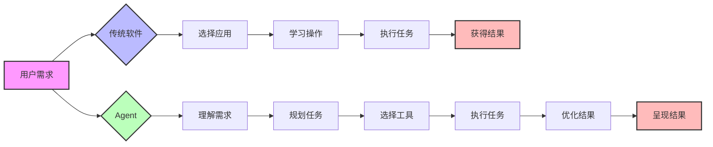
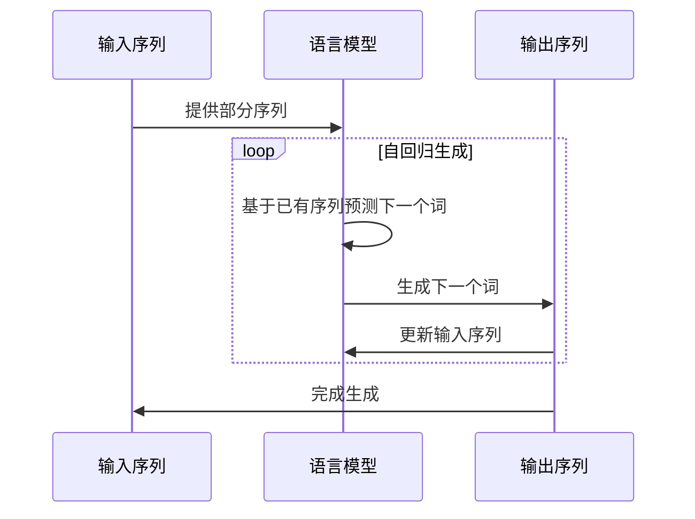
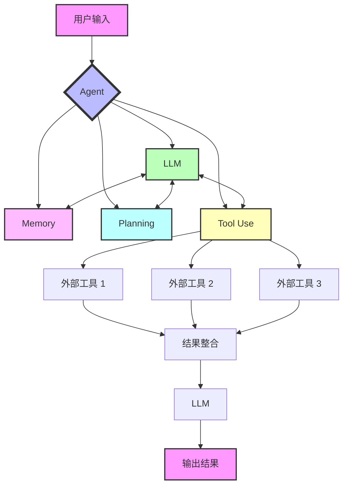
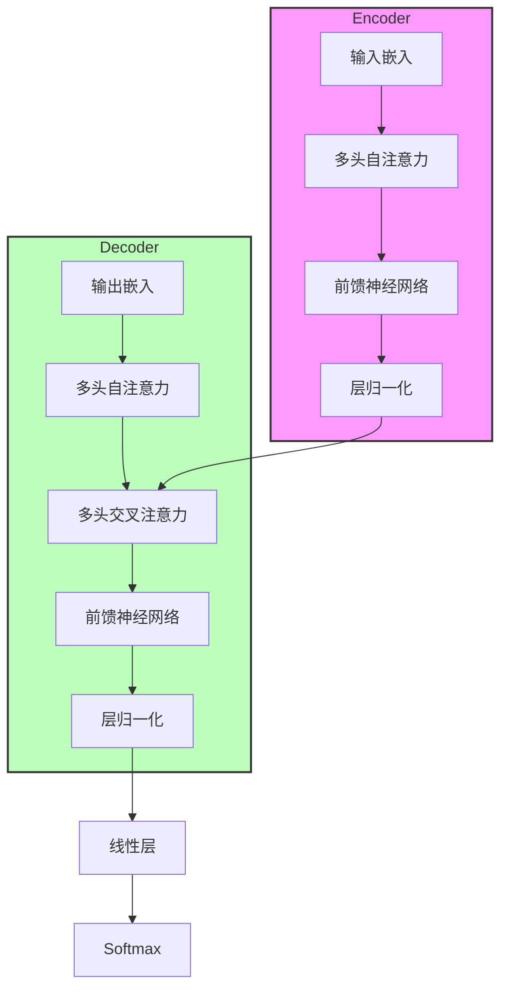
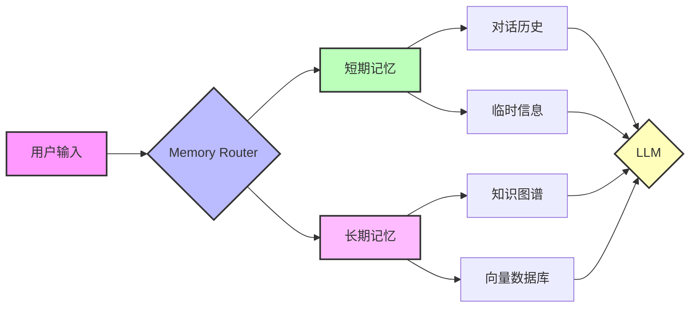
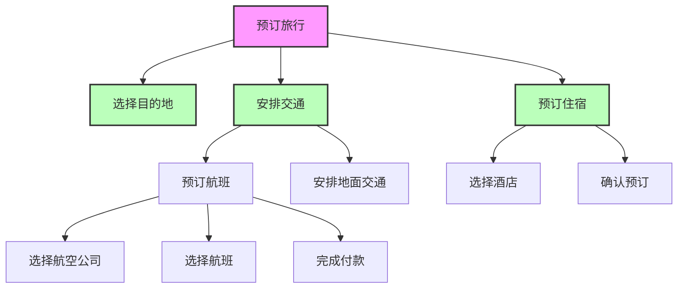
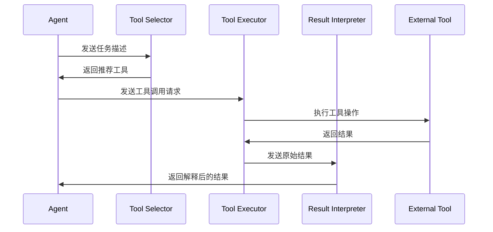
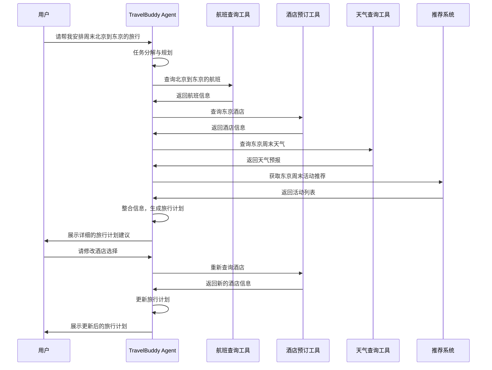

# 5. Agent的本质

## 1. Agent 的定义与本质

在我们深入探讨 Agent 之前，首先需要明确其定义和本质。Agent 一词源自拉丁语 "Agere"，意为 "to do"。在大语言模型（LLM）的语境下，我们可以将 Agent 定义为：

**一种能够自主理解、规划决策和执行复杂任务的智能体。**

这个定义揭示了 Agent 的核心特征：自主性、理解能力、决策能力和执行能力。与传统的 AI 系统不同，Agent 不仅仅是被动地响应输入，而是主动地理解任务、制定计划并采取行动。

比尔·盖茨在他的一篇[长文](https://www.gatesnotes.com/AI-agents)中将 Agent 描述为：

1. "一个对科技行业的冲击波"
2. "一场自'输入命令到点击图标'变革之后计算机领域的最大变革"

这些描述突出了 Agent 在技术革新中的重要地位。要理解 Agent 的革命性，我们需要首先认识到当前软件的局限性。

### 1.1 当前软件的局限

目前的软件，无论多么先进，都存在以下限制：

1. 功能单一：每个应用程序通常只能执行特定的任务。
2. 缺乏上下文理解：软件无法全面了解用户的工作、生活、兴趣爱好与人际关系。
3. 交互方式固定：用户必须学习并适应每个软件的特定操作方式。
4. 无法自主决策：软件只能按照预设的逻辑执行任务，缺乏灵活性。

### 1.2 Agent 的优势

相比之下，Agent 具有以下优势：

1. 多功能集成：一个 Agent 可以执行多种不同类型的任务。
2. 上下文感知：能够理解和利用用户的背景信息来优化任务执行。
3. 自然语言交互：用户可以用日常语言与 Agent 沟通需求。
4. 自主决策：能够根据情况做出判断和选择。

为了更直观地理解 Agent 与传统软件的区别，我们可以用一个 Mermaid 图来展示：

这个图展示了传统软件和 Agent 在处理用户需求时的不同流程。传统软件需要用户自己选择应用、学习操作，而 Agent 则可以自主理解需求、规划任务，并选择合适的工具来执行。

## 2. 从 LLM 到 Agent：AI 的进化之路

要理解 Agent 的重要性，我们需要回顾 AI 特别是自然语言处理（NLP）领域的发展历程。

### 2.1 LLM 的革命性突破

大语言模型（LLM）的出现，特别是以 ChatGPT 为代表的模型，在 NLP 领域引发了一场革命。这些模型展现了接近"全知全能"的表现，几乎消除了传统 NLP 中的大多数任务边界，开创了全新的 NLP 范式。

LLM 的核心优势包括：

1. 海量知识储备
2. 强大的语言理解能力
3. 灵活的多任务处理能力
4. 上下文感知和推理能力

然而，尽管 LLM 表现出色，但它们仍然存在一些固有的局限性。

### 2.2 LLM 的局限性

1. 信息获取受限：LLM 无法实时获取或更新信息，如天气、时间等。
2. 执行能力有限：LLM 只能生成文本，无法直接执行实际操作。
3. 持续对话能力不足：难以保持长期的上下文理解和记忆。
4. 准确性不稳定：可能产生幻觉或不一致的回答。

为了更好地理解 LLM 的工作原理及其局限性，我们可以看一下自回归语言模型的基本结构：

这个序列图展示了自回归语言模型的基本工作流程。模型接收部分输入序列，然后逐步预测和生成后续的词，直到完成整个序列的生成。这个过程说明了为什么 LLM 无法直接访问外部信息或执行实际操作。

### 2.3 Agent：LLM 的进化

Agent 技术的出现正是为了弥补 LLM 的这些不足。Agent 将 LLM 作为其核心组件，但同时集成了其他能力，使其成为一个更加全面和强大的 AI 系统。

根据 OpenAI 应用研究主管翁丽莲（Lilian Weng）的定义，Agent 可以被描述为：

**Agent = LLM + Memory + Planning Skills + Tool Use**

这个公式概括了 Agent 的核心组成部分：

1. LLM：作为 Agent 的"大脑"，提供基础的语言理解和生成能力。
2. Memory：包括短期记忆（如对话历史）和长期记忆（如知识库）。
3. Planning Skills：能够分解复杂任务，制定执行计划。
4. Tool Use：能够选择和使用各种外部工具来完成任务。

为了更好地理解 Agent 的结构和工作流程，我们可以使用以下 Mermaid 图：

这个图展示了 Agent 处理任务的基本流程：

1. 用户输入被送入 Agent。
2. Agent 的核心组件（LLM、Memory、Planning、Tool Use）协同工作。
3. 根据需要，Agent 可以调用各种外部工具。
4. 工具的结果被整合并送回 LLM 进行处理。
5. 最终，Agent 生成并输出结果。

这种结构使 Agent 能够克服 LLM 的局限性，实现更加智能和全面的任务处理能力。

## 3. Agent 的实现原理与核心组件

要深入理解 Agent 的工作原理，我们需要详细分析其每个核心组件的功能和实现方式。

### 3.1 LLM：Agent 的大脑

大语言模型（LLM）是 Agent 的核心，负责语言理解、生成和基础推理。在 Agent 中，LLM 主要承担以下职责：

1. 理解用户输入
2. 生成任务计划
3. 决策工具使用
4. 整合信息并生成输出

LLM 的实现通常基于 Transformer 架构，使用自注意力机制来处理序列数据。以下是一个简化的 Transformer 编码器-解码器结构：

这个结构允许模型在处理输入序列时捕捉复杂的依赖关系，同时在生成输出时考虑整个输入上下文。

### 3.2 Memory：Agent 的记忆系统

Memory 组件使 Agent 能够保持对话连贯性并利用过去的经验。它可以分为两种类型：

1. 短期记忆：存储当前对话的上下文，通常使用向量数据库或简单的缓存实现。
2. 长期记忆：存储持久化的知识和经验，可以使用知识图谱或大规模向量数据库实现。

以下是一个简化的 Agent 记忆系统示意图：

这个系统允许 Agent 在处理新的输入时，同时考虑当前对话上下文和长期积累的知识。

### 3.3 Planning Skills：Agent 的规划能力

规划能力使 Agent 能够将复杂任务分解为可管理的子任务，并制定执行策略。常用的规划方法包括：

1. 分层任务网络（HTN）
2. 基于目标的规划
3. 启发式搜索

以下是一个基于 HTN 的任务分解示例：

这种分层结构允许 Agent 将复杂任务逐步分解为可执行的具体操作。

### 3.4 Tool Use：Agent 的工具使用能力

Tool Use 使 Agent 能够与外部系统交互，执行实际操作。实现 Tool Use 的关键步骤包括：

1. 工具选择：根据任务需求选择合适的工具
2. 参数生成：为选定的工具生成正确的输入参数
3. 结果解释：理解并处理工具返回的结果

以下是一个简化的工具使用流程：

这个流程使 Agent 能够灵活地使用各种外部工具来完成任务。

## 4. Agent 的应用场景与案例分析

Agent 技术的应用潜力巨大，可以在多个领域revolutionize人机交互和任务处理方式。以下是一些典型的应用场景：

1. 个人助理：处理日程安排、邮件管理、信息检索等日常任务
2. 客户服务：提供 24/7 的智能客服支持，处理查询和投诉
3. 教育辅导：根据学生个性化需求提供学习指导和答疑
4. 创意助手：辅助写作、设计、音乐创作等创意工作
5. 研究助手：协助文献检索、数据分析、实验设计等科研活动
6. 医疗诊断：辅助医生进行病情分析和治疗方案制定

让我们通过一个具体的案例来深入分析 Agent 的工作流程：

假设我们有一个名为 "TravelBuddy" 的旅行助手 Agent，用户要求它规划一次从北京到东京的周末旅行。

在这个例子中，我们可以看到 Agent 如何:

1. 理解用户需求
2. 分解任务
3. 使用多个外部工具
4. 整合信息
5. 生成计划
6. 响应用户反馈并进行调整

这种复杂的交互和任务处理能力展示了 Agent 相比传统 AI 系统的显著优势。

## 5. Agent 技术的挑战与未来展望

尽管 Agent 技术展现出巨大潜力，但它仍面临诸多挑战：

1. 安全性和伦理问题：Agent 的自主性可能带来未预期的行为和决策
2. 隐私保护：处理和存储用户数据时的隐私问题
3. 可解释性：理解 Agent 决策过程的困难
4. 鲁棒性：在复杂、不确定环境中保持稳定性能
5. 效率：在资源受限情况下的性能优化

未来，Agent 技术的发展可能会朝以下方向演进：

1. 多模态交互：整合视觉、语音等多种输入输出模式
2. 自主学习：能够从经验中学习并不断改进的 Agent
3. 协作能力：多个 Agent 之间的协作和任务分配
4. 个性化：根据用户特征和偏好定制的 Agent
5. 领域专精：专注于特定领域的高度专业化 Agent

## 结语

Agent 技术代表了 AI 发展的一个重要里程碑，它将改变我们与计算机交互的方式，并有潜力解决许多复杂的实际问题。作为 AI 和 NLP 领域的从业者，深入理解和掌握 Agent 技术将成为未来的关键竞争力。

随着技术的不断进步，我们可以期待看到更多智能、自主、个性化的 Agent 系统出现，它们将在各个领域发挥重要作用，推动人工智能向着更高层次发展。